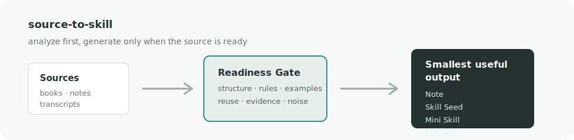
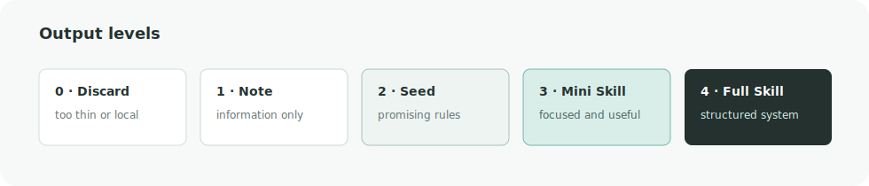

<p align="center">
  
</p>

# source-to-skill

[](https://github.com/GeoLab-org/source-to-skill/actions/workflows/ci.yml)

Not every document deserves a skill.

`source-to-skill` analyzes source material, estimates whether it contains reusable
knowledge, and compiles it into the smallest useful agent-skill artifact: a note,
a skill seed, a mini skill, or a full skill.

It is deliberately conservative. A short meeting transcript should not become a
fake "methodology." A book, course, article series, or dense expert interview may
deserve a real skill. This tool puts a readiness gate in front of generation.



## Why

Most source-to-agent workflows skip the hard question: is this material worth
turning into a persistent behavior?

RAG helps an agent retrieve knowledge. Skills help an agent act with knowledge.
That means a skill needs more than text. It needs reusable judgment, evidence,
scope, and an output contract.

`source-to-skill` starts by scoring the source before writing files.

## Output Levels



| Level | Output | Use when |
|---|---|---|
| 0 | Discard | The source is too thin, local, or noisy |
| 1 | Note | The source has information, but little reusable judgment |
| 2 | Skill Seed | There are useful candidates, but not enough for a standalone skill |
| 3 | Mini Skill | The topic is focused and has enough rules/evidence for a small skill |
| 4 | Full Skill | The source is substantial, structured, and reusable |

## Install

```bash
git clone https://github.com/GeoLab-org/source-to-skill.git
cd source-to-skill
python -m pip install -e .
```

## Usage

Analyze first:

```bash
source-to-skill analyze examples/article.md
```

Analyze a remote article:

```bash
source-to-skill analyze https://example.com/article
```

Build the recommended artifact:

```bash
source-to-skill build examples/article.md --level auto --out out
```

Evaluate a generated skill against its evidence file:

```bash
source-to-skill eval-skill out/review-playbook --json
```

Force a skill seed:

```bash
source-to-skill build examples/meeting-transcript.md --level seed --out out
```

Fold a weak source into an existing skill:

```bash
source-to-skill fold examples/meeting-transcript.md ~/.codex/skills/design-review
```

Clean a transcript before scoring:

```bash
source-to-skill clean-transcript examples/meeting-transcript.vtt \
  --out out/clean-meeting.md \
  --title "Meeting Transcript"

source-to-skill analyze out/clean-meeting.md
```

Transcribe an audio file with an installed Whisper-compatible CLI:

```bash
source-to-skill transcribe-audio recording.m4a \
  --out out/recording.vtt \
  --model base
```

## What It Scores

The v0 scorer is intentionally transparent. It looks for:

- source depth
- section structure
- decision or rule language
- transferability cues
- examples or evidence
- visible conversational noise

It is not a claim of objective truth. It is a quality gate that makes weak inputs
harder to over-promote.

Generated Mini Skill and Full Skill artifacts also include `eval-report.md`, a
small check that compares `Core Guidance` bullets with `references/evidence.md`.
The same check can be run manually with `source-to-skill eval-skill`.

## Example Report

```text
Skill Readiness: 85/100
Recommended output: Mini Skill

Why:
- Structure: clear sectioning and list structure
- Actionability: many rule-like phrases
- Evidence: examples are visible

Caution:
- Short sources usually make better seeds than standalone full skills
```

## Project Status

This is an early project. It supports local UTF-8 text, Markdown, simple HTML,
single-page remote text/HTML URLs, transcript cleanup, and optional
Whisper-compatible audio transcription through an external CLI. PDF, EPUB,
crawled websites, and browser-only pages are intentionally left for later intake
plugins. The first job is to get the skill-worthiness gate right.

## Design Principles

- Do not generate a full skill from every input.
- Keep one-off context separate from reusable rules.
- Prefer a seed over a weak skill.
- Preserve evidence.
- Make the generated artifact small enough to be read and reviewed.

See [docs/philosophy.md](docs/philosophy.md) and
[docs/output-levels.md](docs/output-levels.md). The scoring rules are documented
in [docs/scoring.md](docs/scoring.md). Intake support is documented in
[docs/intake.md](docs/intake.md). Transcript cleanup is documented in
[docs/transcripts.md](docs/transcripts.md). Audio transcription is documented in
[docs/audio.md](docs/audio.md). Skill evidence checks are documented in
[docs/evaluation.md](docs/evaluation.md).

## Roadmap

See [ROADMAP.md](ROADMAP.md).

## Contributing

See [CONTRIBUTING.md](CONTRIBUTING.md). The short version: improve the gate, do
not make weak sources look stronger than they are.

## License

MIT
